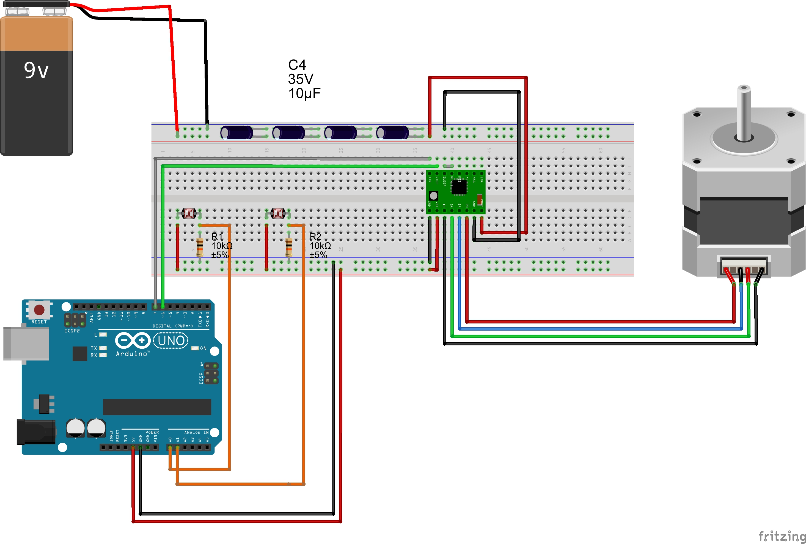

# Arduino.SolarTracker
> Solar tracking (single axis) with arduino 

## Components

* Arduino Uno x1
* Light Dependent Resistor (LDR) x2
* A4988 Stepper Motor Driver x1
* NEMA 17 Stepper Motor x1
* Collimator x2
    * To get direct sunlight to our LDRs.
* DC Power Supply x1
    * 9V Duracell Battery
* 10kΩ Resistor x2
* 10uf 35v Capacitor x4
* Breadboard x1

